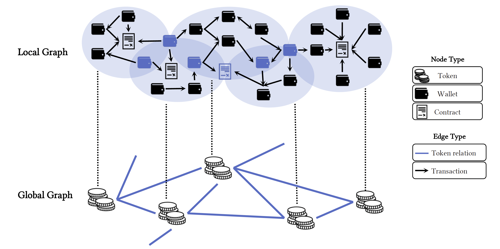

# Multi-Chain Graphs of Graphs Dataset

This is the repository for "Multi-Chain Graphs of Graphs: A New Paradigm in Blockchain Dataset". This comprehensive study introduces a pioneering, large-scale, cross-chain dataset using a graphs-of-graphs approach to analyze complex blockchain networks. 

## Table of Contents
- [Repository Overview](#repository-overview)
- [Dataset Schema](#dataset-schema)
- [Getting Started](#getting-started)
  - [Installation](#installation)
  - [Requirements](#requirements)
  - [Dataset Overview](#dataset-overview)
  - [Dataset Access and Usage](#dataset-access-and-usage)
- [Analyses and Experiments](#using-the-dataset)
  - [Data Preparation](#data-prepare)
  - [Data Analysis](#data-analysis)
  - [Fraud Detection](#fraud-detection)
  - [Multi Classification](#multi-classification)
  - [Link Prediction](#link-prediction)
- [License](#license)

## Repository Overview
This repository contains both the datasets used in our research and the code for analysis and model training. Here you can find everything needed to replicate our studies or use our data and models for your own research.

<p align='center'>
  
</p>

## Dataset Schema
Below are key statistics for each blockchain included in our dataset:

| Chain     | # Tokens | Start Months | End Months | # Transactions | # Addresses | # Categories |
|-----------|----------|--------------|------------|----------------|-------------|--------------|
| Ethereum  | 14,464   | 2016-02      | 2024-02    | 81,788,211     | 10,247,767  | 290          |
| Polygon   | 2,353    | 2020-08      | 2024-02    | 64,882,233     | 1,801,976   | 112          |
| BSC       | 7,499    | 2020-09      | 2024-02    | 121,612,480    | 6,550,399   | 149          |

## Getting Started
### Installation
Clone this repository to your local machine using:
```bash
git clone https://github.com/YourUsername/Graph-of-graphs-dataset.git
cd Graph-of-graphs-dataset
```

## Requirements

Ensure your environment meets the following specifications to successfully run the scripts and models:

- **Python Version**: 3.10.14
- **Libraries**:
  - NumPy 1.26.2
  - pandas 1.3.5
  - PyTorch 2.3.0+cu118
  - networkx 3.3
  - snap-stanford
  - torch-scatter 2.1.2+pt23cu118
  - torch-sparse 0.6.18+pt23cu118
  - torch-cluster 1.6.3+pt23cu118
  - torch-geometric 2.5.3

### Installation

To install the required packages, execute the following command in your terminal:

```bash
pip install numpy==1.26.2 pandas==1.3.5 torch==2.3.0+cu118 networkx==3.3 \
python -m pip install snap-stanford \
torch-scatter==2.1.2+pt23cu118 torch-sparse==0.6.18+pt23cu118 \
torch-cluster==1.6.3+pt23cu118 torch-geometric==2.5.3
```

### Dataset Overview
#### Global Graphs
- Contains data for Ethereum, Polygon, and BSC within the `global_graph` folder:
  - `{chain}_graph_more_than_1_ratio.csv`: Contains edges where the weight—indicative of transactional or interaction metrics—exceeds 1\%. This is the same as the setting of our experiments in the paper. In this file, contracts are denoted by numerical indices rather than traditional addresses.
  - `{chain}_contract_to_number_mapping.json`:  Maps each contract's address to a numerical index utilized in the global graph files, facilitating cross-reference and analysis.

- Example code to build the global graphs for exploration:
```bash 
import networkx as nx
import pandas as pd

df = pd.read_csv(f'{chain}_graph_more_than_1_ratio.csv')
G = nx.Graph()  
for idx, row in df.iterrows():
    G.add_edge(row['Contract1'], row['Contract2'], weight=row['weight'])
```

#### Transactions
The `transactions` folder houses zipped archives with detailed transaction records for all labeled contracts within the aforementioned chains:
- `ethereum.zip`
- `polygon.zip`
- `bsc.zip`
  
Each zip file provides comprehensive transactions for tokens for the respective blockchains. The transactions for each token are stored in a CSV file named after the token's address. Each transaction include block number, sender (from), receiver (to), transaction hash, value, and timestamp.

- Example code to build the local graphs for exploration:
```bash 
import networkx as nx
import pandas as pd

df = pd.read_csv(f'{contract_address}.csv')
G = nx.Graph()  
for idx, row in df.iterrows():
    G.add_edge(row['from'], row['to'], weight=row['value'])
```

#### Labels
The `labels.csv` file categorizes each contract across different chains. It includes:
- `Chain`: Specifies the blockchain platform (e.g., ethereum, polygon, bsc).
- `Contract`: Lists the contract address or identifier.
- `Category`: Represents the category of the contract, indexed by the prevalence of contracts within that category (Category 0 contains the most contracts: fraud).

### Dataset Access and Usage
The dataset is available via [Token Data](https://drive.google.com/drive/folders/1VV5ht9Eh8WGtKfkS0ipIk0FNI7g-WJfJ?usp=share_link). 

To effectively use this dataset, follow these steps:
1. Download the necessary files using the link provided above.
2. Unzip each chain's transaction archive to access individual transaction details.
3. Employ the JSON mapping files to decode contract indices within the global graphs.
4. Refer to `labels.csv` to understand the categorization of each contract, which is crucial for targeted analysis and comparative studies across different categories.

## Analyses and Experiments

### Data Analysis
Scripts for analyzing both local and global graphs are located under `analysis/`. 
- `common_node.py`: Scripts for finding common nodes in token graphs.
- `local_metrics/`: Contains scripts and utilities specifically for calculating various graph metrics on local graphs. 
  - nx_properties.py to measure num_nodes, num_edges, density, assortativity, reciprocity; 
  - snap_properties.py to measure  effective_diameter, clustering_coefficient.
- `local.py`: Script for comparing and performing detailed analysis on local graphs.
- `global.py`: Script for analyzing global graph structures and metrics.


Run the following commands for respective analyses:
```bash
python common_node.py
python local_metrics/nx_properties.py
python local_metrics/snap_properties.py
python local.py
python global.py
```

### Data Preparation
Scripts for preparing data are under `dataset/`. 
- `individual.py`: Script for preparing data for individual graph learning models.
- `gog.py`: Script for preparing data for GoG-based learning models. 
- `create_temporal_link.py`: Script for preparing link prediction data.
- `process_link_gcn.py`: Script for preparing link prediction data for individual GNN models.
- `create_temporal_node.py`: Script for preparing data for multi-class classification GoG models, with temporal splitting of train and test data.
- `process_graph_metrics.py`: Script for preparing graph metrics for anomaly detection models.
- `get_deepwalk_embedding/`: Scripts for preparing deepwalk embedding for anomaly detection models.

```bash
python individual.py
python gog.py
python create_temporal_link.py
python process_link_gcn.py
python create_temporal_node.py
python process_graph_metrics.py

cd get_deepwalk_embedding/
python get_deepwalk.py
```
In addition, when preparing the dataset, you can specify custom filters to refine the data, such as removing tokens with less than 5 transactions or focusing on transactions within a certain year or date range. These settings can be customized for both local and global graphs.

### Fraud Detection
Navigate to `fraud_detection/` to access scripts for anomaly detection applied to individual graphs and graphs-of-graphs:
- `graph_individual/`: Includes code for detecting anomalies in individual graph structures using graph metrics and deepwalk.
- `graph_of_graph/`: Includes code for anomaly detection employing techniques that consider graph models using graph metrics and deepwalk.

```bash
cd graph_individual/
python main.py

cd graph_of_graph/
python main.py
```

### Multi-Class Classification
Navigate to `multi_classification/` to access scripts for performing multi-class classification on both individual graphs and graphs-of-graphs:
- `graph_individual/`: Includes code for classifying individual graphs into multiple categories based on their structural and transactional features.
- `graph_of_graph/`: Includes code for classifying graphs with graphs-of-graphs model.

```bash
cd graph_individual/
python main.py --chain polygon --model GCN

cd graph_of_graph/
python main.py --chain polygon --model SEAL
```

### Link Prediction
Navigate to `link_prediction/` to access scripts for performing link prediction on both individual graphs and graphs-of-graphs:
- `graph_individual/`: Includes code for predicting links on global graph using individual GNN models.
- `graph_of_graph/`: Includes code for predicting links on GoG frameworks using graphs-of-graphs models.

```bash
cd graph_individual/
python main.py --chain polygon

cd graph_of_graph/
python main.py --chain polygon --model SEAL
```


## License
The dataset is released under the Creative Commons Attribution-NonCommercial-ShareAlike (CC BY-NC-SA) license. This means that anyone can use, distribute, and modify the data for non-commercial purposes as long as they give proper attribution and share the derivative works under the same license terms.
